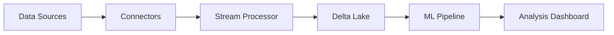

# Marisync 🌊

[](https://www.scala-lang.org/)
[](https://spark.apache.org/)
[](https://delta.io/)
[](https://databricks.com/)
[](https://www.python.org/)
[](LICENSE)

Real-time oceanographic data integration and analysis platform using Databricks.

## Overview

Marisync is a scalable platform for ingesting, processing, and analyzing oceanographic data from multiple sources in real-time. It leverages Scala's type safety and concurrency features along with Databricks' unified analytics platform.

### Data Sources
- NOAA National Data Buoy Center (NDBC)
- Argo Float Network
- Ocean Observatories Initiative (OOI)
- Copernicus Marine Service (CMEMS)
- IOOS (Integrated Ocean Observing System)

### Key Measurements
- Temperature (°C)
- Salinity (PSU)
- Dissolved Oxygen (mg/L)
- pH Levels
- Turbidity (NTU)
- Chlorophyll (μg/L)
- Current Speed (m/s)
- Current Direction (degrees)

## Why Scala?

1. **Type Safety**: Early error detection through strong type system
2. **Concurrency**: Built-in support for handling multiple data streams
3. **Spark Integration**: Native language for Apache Spark
4. **Performance**: JVM-based with functional programming optimizations
5. **Interoperability**: Seamless Java library integration

## Databricks Integration

- Real-time data processing using Structured Streaming
- Delta Lake for ACID transactions and time travel
- MLflow for model tracking and deployment
- Databricks Jobs for orchestration
- Unity Catalog for data governance

## Architecture



## Setup
1. Install dependencies:
   ```bash
   sbt compile
   pip install -r requirements.txt
   ```

2. Configure Databricks CLI:
   ```bash
   pip install databricks-cli
   databricks configure --token
   ```

3. Set environment variables:
   ```bash
   cp .env.template .env
   # Edit .env with your credentials
   ```

## Development

### Running Tests
```bash
sbt test
```

### Local Development
```bash
sbt run
```

### Databricks Deployment
```bash
databricks workspace import
```

## Project Structure
```
marisync/
├── src/
│   ├── main/
│   │   ├── scala/
│   │   │   ├── connectors/    # Data source connectors
│   │   │   ├── pipeline/      # Stream processing
│   │   │   ├── models/        # Data models
│   │   │   └── utils/         # Common utilities
│   │   └── python/
│   │       └── ml/            # Machine learning models
│   └── test/
├── jobs/                      # Databricks job configs
└── notebooks/                 # Databricks notebooks
```

## Contributing

Please read [CONTRIBUTING.md](CONTRIBUTING.md) for details on our code of conduct and the process for submitting pull requests.

## License

This project is licensed under the Apache License 2.0 - see the [LICENSE](LICENSE) file for details.

## Technologies

- **Languages**: Scala, Python
- **Processing**: Apache Spark, Structured Streaming
- **Storage**: Delta Lake
- **Platform**: Databricks
- **ML**: MLflow, scikit-learn
- **Data Sources**: NDBC, Argo, OOI, CMEMS
- **Testing**: ScalaTest, Mockito
- **Build Tool**: sbt 